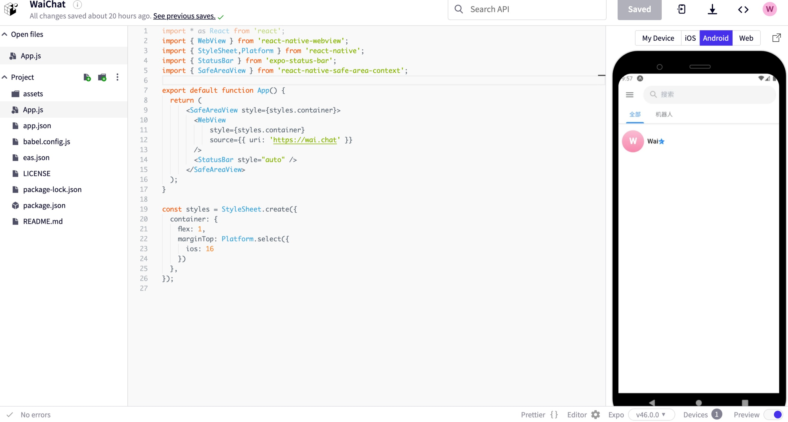

<div align="center">


<h1 align="center">Wai.Chat</h1>

一款基于AI、区块链加密技术,去中文化的私有聊天机器人

A private chatbot based on AI, blockchain encryption technology, and de-Chinese-ization.

[Demo](https://wai.chat/) / [反馈 Issues](https://github.com/ptp-build/wai-chat/issues)


</div>

- IOS
  用 Safari 直接打开https://wai.chat 直接 Add to Home Screen

- Android
  - 下载 [Apk](https://github.com/ptp-build/wai-chat-react-expo/releases/tag/v1.0.1)
  - 下载 [源代码](https://github.com/ptp-build/wai-chat-react-expo)```eas build --platform  android --profile prod```
    自行编译
  - 使用 [Expo Dev](https://snack.expo.dev/@wai.chat/waichat)
    


## 主要功能

- 内置 海量 prompt 来自[中文](https://github.com/PlexPt/awesome-chatgpt-prompts-zh)和[英文](https://github.com/f/awesome-chatgpt-prompts)
- 单机模式和云端存储随意换
- 基于区块链加密技术的多账户管理
- 密钥始终在您的设备，消息、媒体文件加密存储云端，拥有者只有你本人
- 基于 [Telegram](https://github.com/Ajaxy/telegram-tt) 强大的的加解密技术和流畅的前端用户体验
- 友好支持IOS、Android、Web

## 自定义部署

- [在 CloudFlare 中部署](https://github.com/ptp-build/wai-chat/blob/main/docs/deploy-cloudflaure-pages.md) 无需vps,免费


## 开发计划 Roadmap
- 接入更多ai平台和模型
- 支持多人社区群组
- 支持sass化部署


## 开发 Development

```shell
npm run dev
```

## LICENSE

[GPL v3](https://github.com/ptp-build/wai-chat/blob/main/LICENSE)
