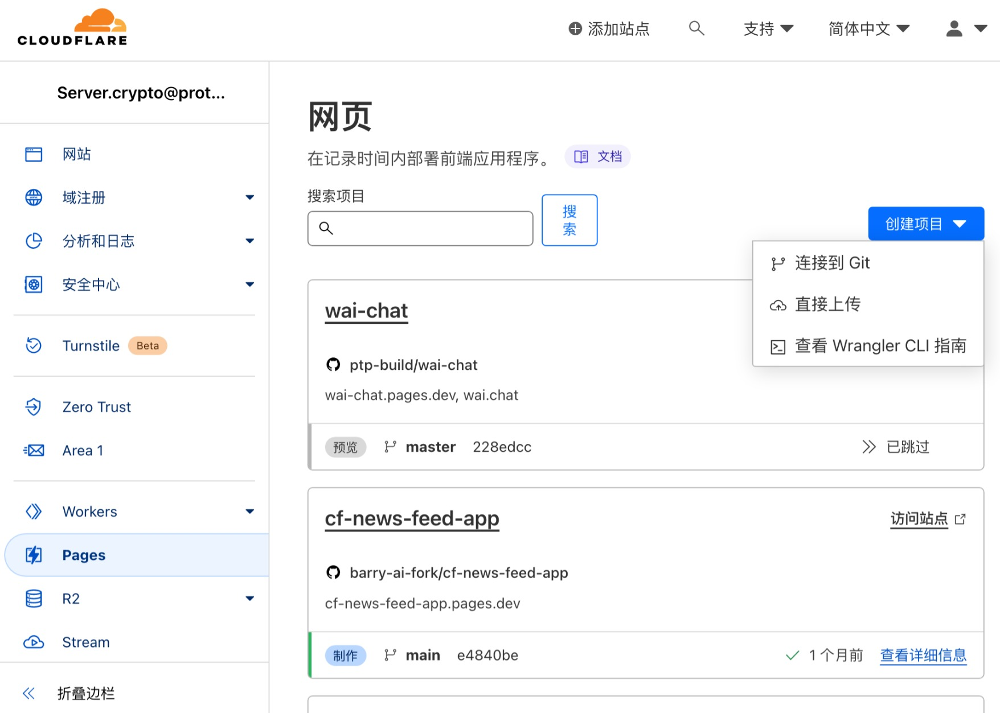
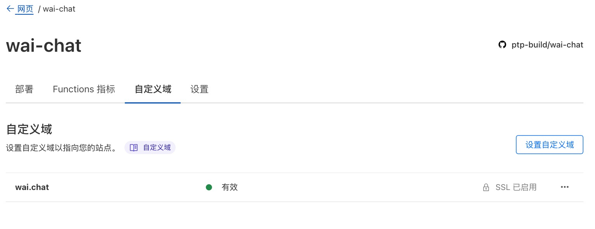
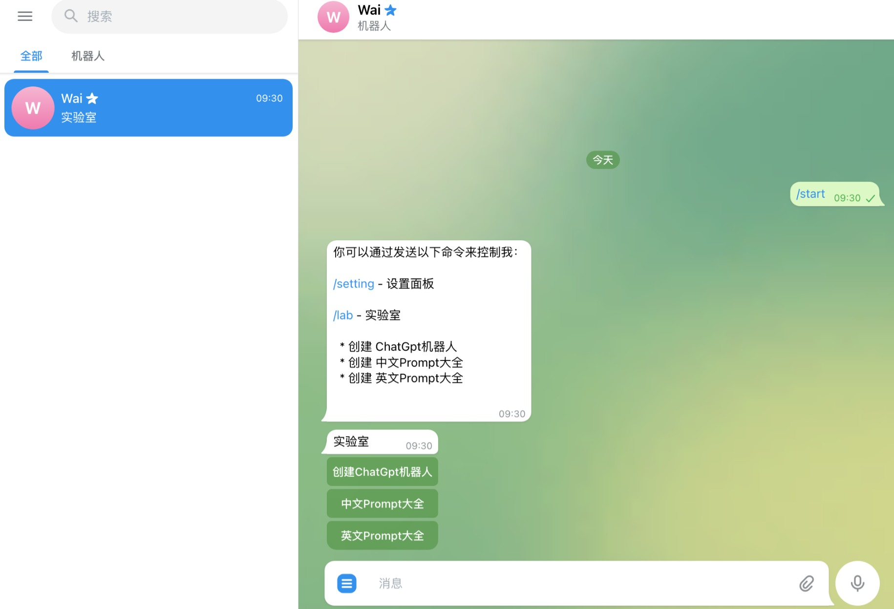

## 在 CloudFlare Pages 中部署

### 1.点击 [Fork](https://github.com/ptp-build/wai-chat/fork),Fork本项目到你的git仓库
### 2.登录 [https://dash.cloudflare.com/login](https://dash.cloudflare.com/login)
### 4.在 Pages 中点击 创建项目 选择 连接到Git,选择 刚刚fork的你的Git仓库，点击开始设置
  

### 5.设置构建和部署，如下：

- 填写项目名称,CloudFlare会按你的项目名称生成一个 .pages.dev 子域名
- 构建输出目录 只需要:**dist**
- 填写完成,直接进入下一步，等待部署完成

### 6.如果你有自己的域名直接 自定义域

### 7.打开CloudFlare给你分配的子域名,点击 /lab > 创建 ChatGpt机器人

### 8.在新创建的机器人中 发送 /apiKey 指令填写你的 openai apikey

### 9.目前模型只支持 【gpt-3.5-turbo】后续会加入跟多模型

